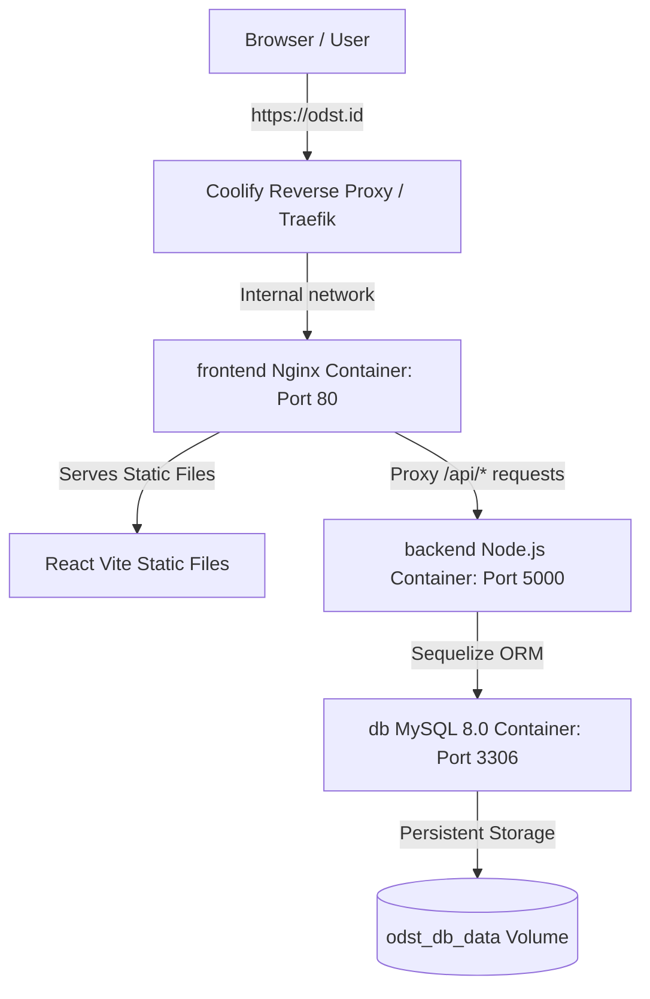

# ODST Group Corporate Portal & Control Center

A modern, high-performance corporate portal for **ODST Group** — a premier conglomerate providing premium hospitality, aviation & charter flight solutions, and bespoke pilgrim tour packages for Hajj & Umrah.

This system is built with a decoupled architecture containing a fast React SPA frontend and a secure Node.js Express **Microservices backend** coordinated by a central **API Gateway** connected to a MySQL database.

---

## 🏛️ Project Architecture

The codebase is split into two primary modules:

1. **`odst-frontend`** (Frontend):
   - **Tech Stack:** React (TypeScript), Vite, Tailwind CSS, Lucide Icons, React Router.
   - **Description:** Premium customer-facing pages (Home, Contact, Privacy, Terms) and a responsive, secure **Admin Control Center Dashboard** for managing inquiries, subscriptions, services, and contacts.

2. **`backend`** (Backend API Gateway & Microservices):
   - **Tech Stack:** Node.js, Express.js, Sequelize ORM, MySQL, Concurrently.
   - **Description:** A microservices architecture where services are split into logical domain modules:
     - **API Gateway (`server.js`):** Pinned on Port `5000`. Acts as the single entry point routing requests to separate microservice ports locally or routing in-memory when deployed in Serverless Vercel Mode.
     - **Auth Service (`services/auth-service.js`):** Runs on Port `5001`. Handles admin credentials, JWT tokens, and account access.
     - **Contact Service (`services/contact-service.js`):** Runs on Port `5002`. Manages user inquiries and contact forms.
     - **Newsletter Service (`services/newsletter-service.js`):** Runs on Port `5003`. Manages newsletter subscriptions.
     - **Content Service (`services/content-service.js`):** Runs on Port `5004`. Handles lander service details and image configurations.

---

## 🚀 Key Features

* **Multi-Language (i18n) Support:** Full internationalization supporting English (EN), Indonesian (ID), and Arabic (AR) with a clean language selector.
  - **Preserved LTR Layout:** The website layout, columns, navigation flow, and text alignment remain standard Left-to-Right (LTR) across all languages for visual consistency, while translating the text.
  - **Bidirectional (BiDi) Rendering:** Correct text and placeholder alignment (`dir="auto"`, `text-left`) for mixed English/Arabic entries (e.g. brand names like `ODST` and numbers render correctly on the left, while Arabic is processed right-to-left).
* **Dynamic Landing Page Services:** Edit titles, badge names, action links, descriptions, image layouts, and upload custom images directly from the dashboard.
* **Direct Connections Directory:** Dedicated tab to adjust phone numbers, email addresses, and locations for division coordinators (Hotels, Airlines, Travel).
* **Live Inquiries Management:** Review and filter customer messages, mark status as Read/Replied, and delete inquiries.
* **Direct Mailchimp Newsletter Integration:** Completely decoupled from the MySQL database. Subscriptions are sent directly and only to the **Mailchimp Marketing API** in real-time.
  - **Real-Time Admin Sync:** The Admin Dashboard's *Newsletter Subscribers* tab fetches active list members directly from Mailchimp in real-time.
  - **Mailchimp Member Controls:** Deleting a subscriber from the Admin panel permanently unsubscribes/removes them from your Mailchimp audience list.
* **Branded Admin Gateways:** Fully customized split-screen brand login page and dashboard using official logos.
* **API Connection Hydration:** Full integration connecting form submissions to live database models with local asset fallback.

---

## ⚙️ Getting Started

### 1. Database Setup
Ensure you have a MySQL server running (e.g. at `localhost:3306`). Create a database named `odst_db`:
```sql
CREATE DATABASE odst_db;
```

### 2. Backend Installation & Dev Server
Navigate to the `backend` folder:
```bash
cd backend
npm install
```

Create a `.env` file inside the `backend` directory based on `.env.example`:
```env
PORT=5000
NODE_ENV=development
DB_HOST=localhost
DB_USER=root
DB_PASS=your_password
DB_NAME=odst_db
JWT_SECRET=your_jwt_secret_token

# Mailchimp Integration
MAILCHIMP_API_KEY=your_mailchimp_api_key
MAILCHIMP_SERVER_PREFIX=us11
MAILCHIMP_AUDIENCE_ID=your_mailchimp_audience_id
```

Run database sync and start the dev server (it will automatically seed the initial admin account `admin@odst.id` / `password123` and default services if the tables are empty). This command runs the API Gateway and all microservices concurrently on ports 5000-5004:
```bash
npm run dev
```

### 3. Frontend Installation & Dev Server
Navigate to the `odst-frontend` folder:
```bash
cd ../odst-frontend
npm install
npm run dev
```
The client website will run at `http://localhost:5173`.

---

## 🐳 Docker & VPS Deployment (Coolify)

This project is fully containerized and optimized for deployment on self-hosted VPS platforms like **Hostinger VPS** using **Coolify** or a direct Docker Compose setup.

### 🏛️ Production Architecture (Single Domain Proxy)

In production, the application is deployed under a **Single Domain** architecture utilizing a custom Nginx reverse proxy inside the frontend container.



- **Zero Port Conflict:** The database (`db`) and `backend` containers do not bind to any host ports (no `ports` mapping exposed publicly), preventing conflicts with other VPS services (like an existing MySQL database on port `3306`).
- **Internal Communication:** Services talk internally within the isolated `odst_network` (`db:3306` and `backend:5000`).
- **No CORS Issues:** Since Nginx proxies `/api` calls internally, the browser sees all traffic coming from the single domain (`odst.id`), completely eliminating cross-origin errors.

### 🛠️ Local Docker Verification

To run and verify the entire stack locally using Docker:
```bash
# Build and start all services in detached mode
docker compose up --build -d
```
The frontend will be served at `http://localhost:8080` (internally proxying API calls to the backend on `http://localhost:5000`).

### 📦 Coolify Deployment Guide (Hostinger VPS)

1. **Push Changes:** Ensure all files are committed and pushed to your Git repository (GitHub/GitLab).
2. **Add Resource:** In the Coolify dashboard, select **Projects** -> **Environment** -> **+ Add New Resource** -> **Docker Compose**.
3. **Repository Connection:** Connect your Git repository. Coolify will automatically detect the root `docker-compose.yml`.
4. **Environment Variables:** In the project settings, add the following variables for the `backend` service:
   - `NODE_ENV` = `production`
   - `PORT` = `5000`
   - `DB_HOST` = `db` (points to the local MySQL container)
   - `DB_PORT` = `3306`
   - `DB_USER` = `avnadmin` (or your custom database username)
   - `DB_PASSWORD` = `your_secure_password` (password for your local VPS database)
   - `DB_NAME` = `odst_group`
   - `DB_SSL` = `false` (disabled for internal Docker network connection)
   - `JWT_SECRET` = `your_jwt_secret_token`
   - `DB_ROOT_PASSWORD` = `your_root_database_password`
5. **Assign Domain:**
   - Under the **frontend** settings in Coolify, assign your domain (e.g. `https://odst.id`).
   - If `odst.id` is still transferring, use Coolify's default `sslip.io` domain (e.g. `http://<YOUR_VPS_IP>.sslip.io`).
6. **Deploy:** Click **Deploy**. Coolify will download the code, compile the React bundle using the multi-stage Dockerfile (enforcing `NODE_ENV=development` during build so devDependencies are installed), set up MySQL persistent storage, and serve the site.

---

## 🔐 Credentials (Initial Seed)
* **Email:** `admin@odst.id` (or username `admin`)
* **Password:** `password123`
*(Make sure to change these credentials from the Admin Profile tab immediately after logging in).*

